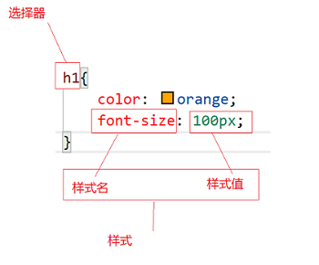

# WEB前端学习记录
## 项目部署
本项目目前基于Coding Pages部署，可通过域名：[http://weblearn.boiltask.com](http://weblearn.boiltask.com)访问。

## 20190104

### 知识点

`HTML` hyper text markup language 超文本标记语言

`meta charset`用于设置页面字符编码格式：
```html
<meta charset="utf-8">
```

`CSS` cascading style sheet 层叠样式表
### 重点

#### margin
`margin`用于设置所有外边距属性。

#### position
`position`规定元素的定位类型。

#### animation
`animation`属性是一个简写属性，用于设置六个动画属性：

- animation-name
- animation-duration
- animation-timing-function
- animation-delay
- animation-iteration-count
- animation-direction

#### radial-gradient
`radial-gradient`用于设置渐变。

CSS3 定义了两种类型的渐变（gradients）：
- 线性渐变（Linear Gradients）- 向下/向上/向左/向右/对角方向
- 径向渐变（Radial Gradients）- 由它们的中心定义

#### display
`display` 属性规定元素应该生成的框的类型。

|值 |描述 |
|-- |-- |
|none				|此元素不会被显示。													|
|block				|此元素将显示为块级元素，此元素前后会带有换行符。					|
|inline				|默认。此元素会被显示为内联元素，元素前后没有换行符。				|
|inline-block		|行内块元素。（`CSS2.1`新增的值）									|
|list-item			|此元素会作为列表显示。												|
|run-in				|此元素会根据上下文作为块级元素或内联元素显示。						|
|compact			|`CSS`中有值`compact`，不过由于缺乏广泛支持，已经从`CSS2.1`中删除。	|
|marker				|`CSS`中有值`marker`，不过由于缺乏广泛支持，已经从`CSS2.1`中删除。	|
|table				|此元素会作为块级表格来显示（类似`<table>`），表格前后带有换行符。	|
|inline-table		|此元素会作为内联表格来显示（类似`<table>`），表格前后没有换行符。	|
|table-row-group	|此元素会作为一个或多个行的分组来显示（类似`<tbody>`）。				|
|table-header-group	|此元素会作为一个或多个行的分组来显示（类似`<thead>`）。				|
|table-footer-group	|此元素会作为一个或多个行的分组来显示（类似`<tfoot>`）。				|
|table-row			|此元素会作为一个表格行显示（类似`<tr>`）。							|
|table-column-group	|此元素会作为一个或多个列的分组来显示（类似`<colgroup>`）。			|
|table-column		|此元素会作为一个单元格列显示（类似`<col>`）							|
|table-cell			|此元素会作为一个表格单元格显示（类似`<td>`和`<th>`）				|
|table-caption		|此元素会作为一个表格标题显示（类似`<caption>`）						|
|inherit			|规定应该从父元素继承`display`属性的值。							|

#### justify-content
在弹性盒对象的各项周围留有空白，如：
```css
div{
    display: flex;
    justify-content: space-around;
}
```

|值 |描述 |
|--	|--	|
|flex-start | 默认值。项目位于容器的开头。 |
|flex-end |项目位于容器的结尾。 |
|center |项目位于容器的中心。 |
|space-between |项目位于各行之间留有空白的容器内。 |
|space-around |项目位于各行之前、之间、之后都留有空白的容器内。	|
|initial |设置该属性为它的默认值。请参阅 initial。 |
|inherit |从父元素继承该属性。请参阅 inherit。 |

[Flex 布局教程：实例篇（骰子）](http://www.ruanyifeng.com/blog/2015/07/flex-examples.html?bsh_bid=683103006)

#### align-items
`align-items` 属性定义flex子项在flex容器的当前行的侧轴（纵轴）方向上的对齐方式。

|值 |描述 |
|-- |-- |
|stretch |默认值。<br>元素被拉伸以适应容器。<br>尺寸尽可能接近所在行的尺寸，但同时会遵照'min/max-width/height'属性的限制。 |
|center |元素位于容器的中心。<br>弹性盒子元素在该行的侧轴（纵轴）上居中放置。<br>（如果该行的尺寸小于弹性盒子元素的尺寸，则会向两个方向溢出相同的长度）。 |
|flex-start |元素位于容器的开头。<br>弹性盒子元素的侧轴（纵轴）起始位置的边界紧靠住该行的侧轴起始边界。 |
|flex-end |元素位于容器的结尾。<br>弹性盒子元素的侧轴（纵轴）起始位置的边界紧靠住该行的侧轴结束边界。 |
|baseline |元素位于容器的基线上。<br>如弹性盒子元素的行内轴与侧轴为同一条，则该值与'flex-start'等效。<br>其它情况下，该值将参与基线对齐。 |
|initial |设置该属性为它的默认值。请参阅 initial。 |
|inherit |从父元素继承该属性。请参阅 inherit。 |

#### border
`border`，设置边框

`solid`，实线

```css
border: solid 1px red;
```

#### border-radius
`border-radius` 设置边框圆角

#### box-shadow
`box-shadow` 设置阴影

## 20190107

### 知识点

#### 让子元素居中
- 使用flex布局
```CSS
display: flex;
justify-content: center;
align-items: center;
```

- More：[web前端中的居中（八种方法）](https://baijiahao.baidu.com/s?id=1570990337723604)

#### 显示圆形
为正方形设置圆角边框

```CSS
#pannel{
	width: 800px;
	height: 800px;
	border: solid 1px #000;
	border-radius: 50%;
}
```

#### 文本居中
水平居中：

使用text-align
```CSS
text-align: center;
```
垂直居中：

设置行号，将行号和元素设置一样可以实现单行文本的垂直居中
```CSS
line-height: [div高度];
```

#### 设置定时器

使用`setInterval`并传入参数

```JS
setInterval(function(){
	//处理语句
}, 1000);
```

可直接传入函数名
```JS
setInterval(timeUpdate, 1000);
```
#### 设置某一块文字
获取组件，设置内容
```JS
var charBox = document.getElementById("char-box");
charBox.textContent = c;
```
### 重点
#### font-weight
设置字体粗细，可使用bold设置最粗

#### Math.random
`Math.random`用于生成一个`[0,1)`的随机数

#### 监听事件
监听键盘的按下事件，为事件绑定一个函数。函数的参数e标识本次事件的事件对象。

```JS
document.body.onkeydown = function(e) {

	if (c == e.key.toUpperCase()) {
	
		//处理语句
	
	}
}
```

## 20190108
### 知识点
#### CSS设置某一属性样式
设置state为blank的元素样式：

```CSS
[state=blank]{
	background-image: url(img/blank.png);
	background-size: 100% 100%;
}
```

## 20190109
### HTML基础、常用标签和CSS基础
#### HTML介绍
HTML:typer text markup languge，超文本标记语言。

XML:extendable markup language，可扩展的标记语言。HTML就是XML的一种扩展语言，HTML用于网页页面设计，它不算是编程语言。

HTML5:第5代HTML语言，是目前最新版本的HTML标准，它在老版本HTML的基础上扩展了一些新的功能。狭义的HTML5指的是第5代HTML语言，广义上的HTML5表示最新一代web前端开发技术的总和（HTML5、CSS3、最新的webAPI）。

纯文本：文件内容只包含文本信息，不包含文本的样式，纯文本文件可以使用文本编辑器（vscode、windows的记事本）打开查看和编辑，例如.txt、.html、.c、.java（任何语言的源代码文件），

超文本：内容中出了文本内容之外，还包含文本的样式以及多媒体、超链接等，html就是一种超文本语言。

html文件本质是一个纯文本文件，它内部使用标签记录文本内容和文本样式，当使用文本编辑器打开html文件时，看见的是html的源代码，而使用浏览器打开时，浏览器会对html内容进行解析，将html渲染为完整的页面，页面中呈现的是超文本内容。

#### HTML基本结构

详见文件：[HTML基本结构](study/HTML基本结构.html)

可查看源代码文件以方便理解

#### HTML标签结构

html标签按照结构分为双标签和单标签：

双标签是成对出现的

```HTML
<xxx></xxx>
```

其中`<xxx>`叫开始标签，`</xxx>`叫做单标签（闭合标签）

单标签只有一个标签

```HTML
<xxx>
```

在有些严格的html版本中，单标签必须添加闭合斜线：`<xxx/>`

但是html5中单标签不需要添加闭合斜线

---
双标签的开始和结束中的文本，叫做标签的内容

```HTML
<xxx>yyyyyyyy</xxx>
```

yyyyyyyy就是xxx标签的内容

---
标签属性：自开始标签或单标签的标签名之后，`>`之前，可以为标签添加属性

```HTML
<xxx a1="v1" a2="v2" a3></xxx>
```

一个标签可以添加多个属性，属性之间使用空格隔开，属性的值最好使用双引号包括。

属性可以只有属性名，没有属性值。


#### HTML常用基本标签

详见文件：[HTML常用基本标签](study/HTML常用基本标签.html)

可查看源代码文件以方便理解

#### HTML转义字符

详见文件：[HTML转义字符](study/HTML转义字符.html)

可查看源代码文件以方便理解

#### HTML行内样式和CSS

详见文件：[HTML行内样式和CSS](study/HTML行内样式和CSS.html)

可查看源代码文件以方便理解

CSS:cascading style sheet，层叠样式表。
CSS用于为页面中的标签添加样式。

CSS语法结构：

```CSS
选择器{
	样式名1:样式值1;
	样式名2:样式值2;
	……
}
```

选择器的作用是匹配页面中的某些元素，页面中匹配到的元素会按照这条样式规则显示。

一条样式规则中可以添加多个样式，之间用;隔开

每行样式包含了样式名和样式值。

一个样式表中可以有多条样式规则。



#### CSS基本选择器

详见文件：[CSS基本选择器](study/CSS基本选择器.html)

可查看源代码文件以方便理解

#### CSS基本样式

详见文件：[CSS基本样式](study/CSS基本样式.html)

可查看源代码文件以方便理解

#### div和定宽居中

详见文件：[div和定宽居中](study/div和定宽居中.html)

可查看源代码文件以方便理解

#### 作业：个人主页

重点：banner图、定宽居中

详见项目：[个人主页](HomePage)

可查看源代码文件以方便理解

## 20190110

### 布局、定位、表格、列表

#### 常用文本标签和HTML语义化

详见文件：[常用文本标签和HTML语义化](study/常用文本标签和HTML语义化.html)

可查看源代码文件以方便理解

#### 行元素、块元素、行内块元素

详见文件：[行元素、块元素、行内块元素](study/行元素、块元素、行内块元素.html)

可查看源代码文件以方便理解

#### 文档流

在html页面中，元素按照从上到下，从左到右的顺序依次排列，每个元素在页面布局中都有自己的位置。

元素在页面中排布的结构顺序，叫做页面的文档流。

正常情况下，每一个元素在文档流中都有自己的位置。如果某个元素脱离了文档流，那么这个元素将不再参与流式布局，文档流中也就不再有这个元素的位置。

一个元素的内部也是一个内部文档流。

详见文件：[文档流](study/文档流.html)

可查看源代码文件以方便理解

#### 表格标签

详见文件：[表格标签](study/表格标签.html)

可查看源代码文件以方便理解

#### CSS伪类和伪元素

详见文件：[CSS伪类和伪元素](study/CSS伪类和伪元素.html)

可查看源代码文件以方便理解

#### 有序列表和无序列表

详见文件：[有序列表和无序列表](study/有序列表和无序列表.html)

可查看源代码文件以方便理解

#### 页内跳转

详见文件：[页内跳转](study/页内跳转.html)

可查看源代码文件以方便理解

#### 作业

##### 个人主页

详见项目：[个人主页](HomePage/)

可查看源代码文件以方便理解

##### div布局

详见项目：[div布局](homework/divlayout.html)

可查看源代码文件以方便理解

##### 费用报销单

详见项目：[费用报销单](homework/expensetable.html)

可查看源代码文件以方便理解

## 20190111

### 背景图片、边框、圆角、盒模型、浮动

#### 子元素在父元素中居中

详见文件：[子元素在父元素中居中](study/子元素在父元素中居中.html)

可查看源代码文件以方便理解

#### 背景图片

详见文件：[背景图片](study/背景图片.html)

可查看源代码文件以方便理解

#### 图片精灵

详见文件：[图片精灵](study/图片精灵.html)

可查看源代码文件以方便理解

#### 元素内容溢出

详见文件：[元素内容溢出](study/元素内容溢出.html)

可查看源代码文件以方便理解

#### 边框和圆角

详见文件：[边框和圆角](study/边框和圆角.html)

可查看源代码文件以方便理解

#### 外间距和内间距

详见文件：[外间距和内间距](study/外间距和内间距.html)

可查看源代码文件以方便理解

#### 盒模型

详见文件：[盒模型](study/盒模型.html)

可查看源代码文件以方便理解

#### 元素外间距重叠

详见文件：[元素外间距重叠](study/元素外间距重叠.html)

可查看源代码文件以方便理解

#### 行元素和块元素之间的间隙问题

详见文件：[行元素和块元素之间的间隙问题](study/行元素和块元素之间的间隙问题.html)

可查看源代码文件以方便理解


#### 浮动布局

详见文件：[浮动布局](study/浮动布局.html)

可查看源代码文件以方便理解

#### 长度单位

详见文件：[长度单位](study/长度单位.html)

可查看源代码文件以方便理解

#### 作业

##### 字体图标库制作

详见项目：[个人主页](HomePage/)

可查看源代码文件以方便理解

##### float导航条

详见项目：[个人主页](HomePage/)

可查看源代码文件以方便理解

##### 饿了么商家块

详见项目：[饿了么商家块](Eleitem/)

可查看源代码文件以方便理解